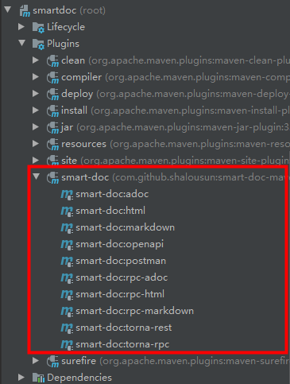
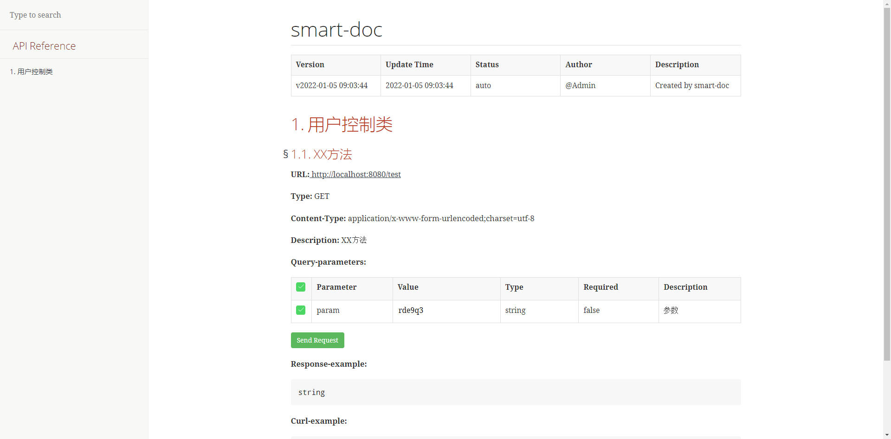

# Smart Doc 使用说明

## 使用步骤

1. 在`pom.xml`中添加`smart-doc`的maven依赖

```xml
<dependency>
    <groupId>com.github.shalousun</groupId>
    <artifactId>smart-doc</artifactId>
    <version>2.3.6</version>
</dependency>
```

2. 在启动模块中添加`smart-doc plugin`

```xml
<plugin>
    <groupId>com.github.shalousun</groupId>
    <artifactId>smart-doc-maven-plugin</artifactId>
    <version>2.3.6</version>
    <configuration>
        <!--指定生成文档的使用的配置文件,配置文件放在自己的项目中-->
        <configFile>./src/main/resources/smart-doc.json</configFile>
        <!--指定项目名称-->
        <projectName>测试</projectName>
        <!--smart-doc实现自动分析依赖树加载第三方依赖的源码，如果一些框架依赖库加载不到导致报错，这时请使用excludes排除掉-->
        <excludes>
            <!--格式为：groupId:artifactId;参考如下-->
            <!--也可以支持正则式如：com.alibaba:.* -->
            <exclude>com.alibaba:fastjson</exclude>
        </excludes>
        <!--includes配置用于配置加载外部依赖源码,配置后插件会按照配置项加载外部源代码而不是自动加载所有，因此使用时需要注意-->
        <!--smart-doc能自动分析依赖树加载所有依赖源码，原则上会影响文档构建效率，因此你可以使用includes来让插件加载你配置的组件-->
        <includes>
            <!--格式为：groupId:artifactId;参考如下-->
            <!--也可以支持正则式如：com.alibaba:.* -->
            <include>com.alibaba:fastjson</include>
        </includes>
    </configuration>
    <executions>
        <execution>
            <!--如果不需要在执行编译时启动smart-doc，则将phase注释掉-->
            <phase>compile</phase>
            <goals>
                <!--smart-doc提供了html、openapi、markdown等goal，可按需配置-->
                <goal>html</goal>
            </goals>
        </execution>
    </executions>
</plugin>
```

3. `plugin`中声明了使用的`smart-doc config`配置文件的文件路径，在对应的路径下创建该文件

示例：

> src/main/resources/smart-doc.json

4. 根据实际情况填写配置`smart-doc.json`

```json
{
  "serverUrl": "http://127.0.0.1", //服务器地址,非必须。导出postman建议设置成http://{{server}}方便直接在postman直接设置环境变量
  "pathPrefix": "", //设置path前缀,非必须。如配置Servlet ContextPath 。@since 2.2.3
  "isStrict": false, //是否开启严格模式
  "allInOne": true,  //是否将文档合并到一个文件中，一般推荐为true
  "outPath": "D://md2", //指定文档的输出路径
  "coverOld": true,  //是否覆盖旧的文件，主要用于mardown文件覆盖
  "createDebugPage": true,//@since 2.0.0 smart-doc支持创建可以测试的html页面，仅在AllInOne模式中起作用。
  "packageFilters": "",//controller包过滤，多个包用英文逗号隔开，2.2.2开始需要采用正则：com.test.controller.*
  "md5EncryptedHtmlName": false,//只有每个controller生成一个html文件是才使用
  "style":"xt256", //基于highlight.js的代码高设置,可选值很多可查看码云wiki，喜欢配色统一简洁的同学可以不设置
  "projectName": "smart-doc",//配置自己的项目名称，不设置则插件自动获取pom中的projectName
  "framework": "spring",//smart-doc默认支持spring和dubbo框架的文档，使用默认框架不用配置，当前支持spring、dubbo、JAX-RS(待完善)
  "skipTransientField": true,//目前未实现
  "sortByTitle":false,//接口标题排序，默认为false,@since 1.8.7版本开始
  "showAuthor":true,//是否显示接口作者名称，默认是true,不想显示可关闭
  "requestFieldToUnderline":true,//自动将驼峰入参字段在文档中转为下划线格式,//@since 1.8.7版本开始
  "responseFieldToUnderline":true,//自动将驼峰入参字段在文档中转为下划线格式,//@since 1.8.7版本开始
  "inlineEnum":true,//设置为true会将枚举详情展示到参数表中，默认关闭，//@since 1.8.8版本开始
  "recursionLimit":7,//设置允许递归执行的次数用于避免一些对象解析卡主，默认是7，正常为3次以内，//@since 1.8.8版本开始
  "allInOneDocFileName":"index.html",//自定义设置输出文档名称, @since 1.9.0
  "requestExample":"true",//是否将请求示例展示在文档中，默认true，@since 1.9.0
  "responseExample":"true",//是否将响应示例展示在文档中，默认为true，@since 1.9.0
  "urlSuffix":".do",//支持SpringMVC旧项目的url后缀,@since 2.1.0
  "displayActualType":false,//配置true会在注释栏自动显示泛型的真实类型短类名，@since 1.9.6
  "appKey": "20201216788835306945118208",// torna平台对接appKey,, @since 2.0.9
  "appToken": "c16931fa6590483fb7a4e85340fcbfef", //torna平台appToken,@since 2.0.9
  "secret": "W.ZyGMOB9Q0UqujVxnfi@.I#V&tUUYZR",//torna平台secret，@since 2.0.9
  "openUrl": "http://localhost:7700/api",//torna平台地址，填写自己的私有化部署地址@since 2.0.9
  "debugEnvName":"测试环境", //torna环境名称
  "debugEnvUrl":"http://127.0.0.1",//推送torna配置接口服务地址
  "tornaDebug":false,//启用会推送日志
  "ignoreRequestParams":[ //忽略请求参数对象，把不想生成文档的参数对象屏蔽掉，@since 1.9.2
     "org.springframework.ui.ModelMap"
   ],
  "dataDictionaries": [{ //配置数据字典，没有需求可以不设置
      "title": "http状态码字典", //数据字典的名称
      "enumClassName": "com.power.common.enums.HttpCodeEnum", //数据字典枚举类名称
      "codeField": "code",//数据字典字典码对应的字段名称
      "descField": "message"//数据字典对象的描述信息字典
  }],
  "errorCodeDictionaries": [{ //错误码列表，没有需求可以不设置
    "title": "title",
    "enumClassName": "com.power.common.enums.HttpCodeEnum", //错误码枚举类
    "codeField": "code",//错误码的code码字段名称
    "descField": "message"//错误码的描述信息对应的字段名
  }],
  "revisionLogs": [{ //文档变更记录，非必须
      "version": "1.0", //文档版本号
      "revisionTime": "2020-12-31 10:30", //文档修订时间
      "status": "update", //变更操作状态，一般为：创建、更新等
      "author": "author", //文档变更作者
      "remarks": "desc" //变更描述
    }
  ],
  "customResponseFields": [{ //自定义添加字段和注释，一般用户处理第三方jar包库，非必须
      "name": "code",//覆盖响应码字段
      "desc": "响应代码",//覆盖响应码的字段注释
      "ownerClassName": "org.springframework.data.domain.Pageable", //指定你要添加注释的类名
      "ignore":true, //设置true会被自动忽略掉不会出现在文档中
      "value": "00000"//设置响应码的值
  }],
  "customRequestFields": [{ //自定义请求体的注释，@since 2.1.3，非必须
       "name":"code", //属性名
       "desc":"状态码", //描述
       "ownerClassName":"com.xxx.constant.entity.Result", //属性对应的类全路径
       "value":"200", //默认值或者mock值
       "required":true, //是否必填
       "ignore":false //是否忽略
  }],
  "requestHeaders": [{ //设置请求头，没有需求可以不设置
      "name": "token",//请求头名称
      "type": "string",//请求头类型
      "desc": "desc",//请求头描述信息
      "value":"token请求头的值",//不设置默认null
      "required": false,//是否必须
      "since": "-",//什么版本添加的改请求头
      "pathPatterns": "/app/test/**",//请看https://smart-doc-group.github.io/#/zh-cn/diy/advancedFeatures?id=公共请求头
      "excludePathPatterns":"/app/page/**"//请看https://smart-doc-group.github.io/#/zh-cn/diy/advancedFeatures?id=公共请求头
  },{
      "name": "appkey",//请求头
      "type": "string",//请求头类型
      "desc": "desc",//请求头描述信息
      "value":"appkey请求头的值",//不设置默认null
      "required": false,//是否必须
      "pathPatterns": "/test/add,/testConstants/1.0",//正则表达式过滤请求头,url匹配上才会添加该请求头，多个正则用分号隔开
      "since": "-"//什么版本添加的改请求头
  }],
  "requestParams": [ //公共请求参数(通过拦截器处理的场景)，@since 2.2.3,没有需求请不要设置
    {
      "name": "configPathParam",//请求参数名称
      "type": "string",//请求参数类型
      "desc": "desc",//请求参数描述信息
      "paramIn": "path",
      "value":"testPath",//不设置默认null
      "required": false,//是否必须
      "since": "-",//什么版本添加的改请求参数
      "pathPatterns": "*",//正则表达式过滤请求参数
      "excludePathPatterns":"/app/page/**" //参考请求头中的用法
    },
    {
      "name": "configQueryParam",//请求参数名称
      "type": "string",//请求参数类型
      "desc": "desc",//请求参数描述信息
      "paramIn": "query",
      "value":"testQuery",//不设置默认null
      "required": false,//是否必须
      "since": "-",//什么版本添加的改请求参数
      "pathPatterns": "*",//正则表达式过滤请求参数
      "excludePathPatterns":"/app/page/**"
    }
  ],
  "rpcApiDependencies":[{ // 项目开放的dubbo api接口模块依赖，配置后输出到文档方便使用者集成
        "artifactId":"SpringBoot2-Dubbo-Api",
        "groupId":"com.demo",
        "version":"1.0.0"
   }],
  "rpcConsumerConfig": "src/main/resources/consumer-example.conf",//文档中添加dubbo consumer集成配置，用于方便集成方可以快速集成
  "apiObjectReplacements": [{ // 自smart-doc 1.8.5开始你可以使用自定义类覆盖其他类做文档渲染，非必须
      "className": "org.springframework.data.domain.Pageable",
      "replacementClassName": "com.power.doc.model.PageRequestDto" //自定义的PageRequestDto替换Pageable做文档渲染
  }],
  "apiConstants": [{//从1.8.9开始配置自己的常量类，smart-doc在解析到常量时自动替换为具体的值，非必须
        "constantsClassName": "com.power.doc.constants.RequestParamConstant"
  }],
  "responseBodyAdvice":{ //自smart-doc 1.9.8起，非必须项，ResponseBodyAdvice统一返回设置(不要随便配置根据项目的技术来配置)，可用ignoreResponseBodyAdvice tag来忽略
          "className":"com.power.common.model.CommonResult" //通用响应体
  },
  "requestBodyAdvice":{ ////自smart-doc 2.1.4 起，支持设置RequestBodyAdvice统一请求包装类，非必须
         "className":"com.power.common.model.CommonResult"
  },
  "groups": [ // @since 2.2.5, 对不同的controller进行分组
    {
      "name": "测试分组",
      "apis": "com.power.doc.controller.app.*"
    }
  ],
  "requestParamsTable": true, // 是否将请求参数表展示在文档中，默认true，@since 2.2.5
  "responseParamsTable": true //是否将响应参数表展示在文档中, 默认true，@since 2.2.5
}
```

5. 对应的接口、实体类上添加标准JAVA注释

```java
/**
 * XX方法
 *
 * @param param 参数
 * @return 结果
 */
@GetMapping("/test")
public String test(String param) {
    return param;
}
```

6. 生成接口文档

- 在IDEA中，可以直接通过maven help在Plugins，smart-doc插件生成对应的文档



- 使用`mvn`命令生成接口文档

```shell script
//生成html
mvn -Dfile.encoding=UTF-8 smart-doc:html
//生成markdown
mvn -Dfile.encoding=UTF-8 smart-doc:markdown
//生成adoc
mvn -Dfile.encoding=UTF-8 smart-doc:adoc
//生成postman json数据
mvn -Dfile.encoding=UTF-8 smart-doc:postman
// 生成 Open Api 3.0+,Since smart-doc-maven-plugin 1.1.5
mvn -Dfile.encoding=UTF-8 smart-doc:openapi
// 生成文档推送到Torna平台
mvn -Dfile.encoding=UTF-8 smart-doc:torna-rest

// Apache Dubbo RPC文档
// Generate html
mvn -Dfile.encoding=UTF-8 smart-doc:rpc-html
// Generate markdown
mvn -Dfile.encoding=UTF-8 smart-doc:rpc-markdown
// Generate adoc
mvn -Dfile.encoding=UTF-8 smart-doc:rpc-adoc

// 生成dubbo接口文档推送到torna
mvn -Dfile.encoding=UTF-8 smart-doc:torna-rpc
```

7. 接口文档效果图



## JAVA注释规范

| 标签 | 说明 | 标签类型 |
|----|----|----|
| @author 作者 | 作者标识 | 包、 类、接口 |
| @version 版本号 | 版本号 | 包、 类、接口 |
| @param 参数名 描述 | 方法的入参名及描述信息，如入参有特别要求，可在此注释 | 构造函数、 方法 |
| @return 描述 | 对函数返回值的注释 | 方法 |
| @deprecated 过期文本 | 标识随着程序版本的提升，当前API已经过期，仅为了保证兼容性依然存在，以此告之开发者不应再用这个API | 包、类、接口、值域、构造函数、 方法 |
| @throws异常类名 | 构造函数或方法所会抛出的异常 | 构造函数、 方法 |
| @exception 异常类名 | 同@throws | 构造函数、 方法 |
| @see 引用 | 查看相关内容，如类、方法、变量等 | 包、类、接口、值域、构造函数、 方法 |
| @since 描述文本 | API在什么程序的什么版本后开发支持 | 包、类、接口、值域、构造函数、 方法 |
| @Description | 对类，方法，接口的简单描述 | 类、接口、方法 |
| @data | 用于显示类，方法，接口具体创建时间，或者修改时间 | 类、接口、方法 |
| @inheritDoc | 继承的文档 | 类、接口、成员方法 |
| {@link包.类#成员 标签} | 链接到某个特定的成员对应的文档中 | 包、类、接口、值域、构造函数、 方法 |
| {@value} | 当对常量进行注释时，如果想将其值包含在文档中，则通过该标签来引用常量的值 | 静态值域 |